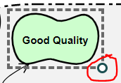
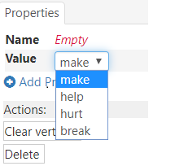
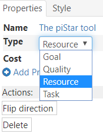
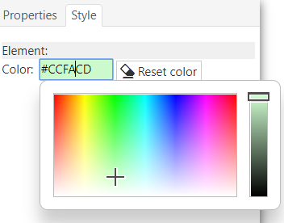

# User Manual to piStar Tool

This manual is divided into two parts, one to show the overview of the tool, which informs the user about the areas where it can interact 
with the piStar Tool. The second part shows in detail enumerated, showing the step by step actions that the user can perform in the tool.

## Part 1: Tool Overview

The piStar Tool is shown with a three-part splash screen, the Menu Bar, Properties Bar, and a Drawing Area with an example of a base model.

**The Menu Bar is divided into four sub-areas:**

1. **File**: Where you can save and load the template, save the template as an image, and create a new blank template.

2. **Add**: Where you can select the elements, links, dependencies, contributions, and refinements you want to add to the template

3. **Options**: Where you can perform privacy and visual settings, such as putting in full screen mode, making changes to the links you create, and changing the dimensions of the drawing area.

4. **Help**: Where you can find examples of model to base, links to research related to piStar Tool and about language i * a quick help on the tool itself.

**The Properties Bar is where the user sees and adds properties to their elements and template:**

**The Drawing Area is where the user make the model:**

## Part 2: Tool Actions

You can split a user's actions into five action sections. File Action, Preview Action, Change Action, Delete Action, and Add Action. The user can go to the section that represents the action he will take on his model.

1. **File Action:**

* To create a new model:
  1. Scroll to the Menu Bar and select File
  2. Select New Model
  3. Press OK
  4. **Result**: This action will delete your current template and leave the Drawing Area blank.
  
* To save your model:
  1. Scroll to the Menu Bar and select File
  2. Select Save Model
  3. **Result**: This action will download a file with the .txt extension called goalModel in the default directory of your browser
  
* To load your model:
  1. Scroll to the Menu Bar and select File
  2. Select Load Model
  3. Click Choose File, and then click Load Model.
  
* To To save your model as an image:
  1. Scroll to the Menu Bar and select File
  2. Select Save Image
  3. If desired, rename the file to be saved in the File Name field
  4. If desired, check the *checkbox* to apply the "*pixel-perfect-links*" effect, which adjusts the image by eliminating gaps between links and elements
  5. If desired, click on SVG to choose the format you want to save the image, being possible to choose between SVG and PNG.
  6. Click Save Image
  7. **Result**: This action will download your template in the format chosen in your browser's default directory

2. **View Action:**

* To use de tool in fullscreen
  1. Press button F11 in keyboard
  
  **Alternative**
    1. Scroll to the Menu Bar and select Options
    2. Click "Toggle Fullscreen"
  **Note:** Repeat to exit full screen mode
  
* To remove the gaps beteween the links and the elements:
  1. Scroll to the Menu Bar and select Options
  2. Click on "Pixel-perfect-links"
  3. **Result**: You will wait a few seconds for the tool to process the action and your model will be without any gaps between the links and elements, as in the example image:
  
         
  
* To zoom in on the project:
  1. Use your brwoser zoom

3. **Change Action:**

* To rename an element:
  1. Double click the element
  2. On the Edit Name screen, enter the name you want and click OK
  
  **Alternative**
    1. Double click the element
    2. Go to the Properties Bar and rename the contents of the Name property
    
* To collapse or expand an Actor, Role, or Agent:
  1. Holding the Alt key, click the element you want to collapse or expand
  2. **Result**: If the element is collapsed, it will expand; if the element is expanded, it will collapse
  
  **Alternative**
    1. Click the element you want to collapse or expand
    2. Go to the Properties Bar and click Collapse / Expand
    
* To change the size of the Drawing Area:
  1. Scroll to the Menu Bar and select Options
  2. Change the Diagram Size values in terms of how many pixels you want to have in height and width.
  3. **Note**: This action may leave elements of your model covered

* To resize an element:
  1. Click the element and use the resize handle
  2. For the element to return to the default size, double-click the element
  3. **Note**: Actor / Agent / Role is resized automatically when an element reaches its edges
  
  
  
* To change the label of a contribution link:
  1. Click the contribution link you want to change
  2. Go to the Properties Bar
  3. In the Value property, click the drop-down list to open your content and select the contribution you want.
  
  
  
* Change dependency type on dependency links:
  1. Click the dependency link that you want to change
  2. Go to the Properties Bar
  3. In the Type property, click the drop-down list to open its content and select the type of dependency you want.
  
  
  
* Para inverter a direção dos links de dependência: 
  1. Click the dependency link you want to invert the direction
  2. Go to the Properties Bar
  3. In the Actions section click on Flip Direction
  
* To change the color of an element:
  1. Click the element you want to change the color
  2. Go to the Properties Bar
  3. In the Style section click on the coloring code for the Color field
  4. **Note**: To return to the default color of the tool click Reset Color
  
  
  
4. **Delete Action:**

* To delete an element:
  1. Click the element you want to delete
  2. Press the delete key
  3. **Note 1**: When deleting elements that are connected to the links, the links will also be deleted
  4. **Note 2**: When deleting elements of Actor / Role / Agent all the elements that are inside will also be deleted
  
  **Alternative**
    1. Click the element or link you want to delete
    2. Go to the Properties Bar
    3. In the Actions section click on Delete
    
* To delete a link:
  1. Click the link you want to delete
  2. Press the delete key
  3. **Note**: When you delete any side of the direction of a dependency link, the entire dependency link will be deleted
  
  **Alternative**
    1. Click the link you want to delete
    2. Go to the Properties Bar
    3. In the Actions section click on Delete
  
* To delete vertices:
  **Delete a specific vertex:**
    1. Dê duplo clique no vértice que deseja deletar
  **Delete all the vertices of a link:**
    1. Click the link you want to delete the vertices
    2. Go to the Properties Bar
    3. In the Actions section click on Clear Vertices
  **Deletar todos os vértices do modelo:**
    1. Go to the Menu Bar and click Options
    2. Click Straighten all links, and then click OK
  
5. **Add Action:**

* To add a property:
  1. Click in the Drawing Area if the property is the template; Click the element or link if the property is for an element or link
  2. Go to the Properties Bar
  3. Click Add Property
  4. Enter the name of the property and click OK

* To add an Actor / Role / Agent element
  1. Be in the Add section of the Menu Bar
  2. Click Actor and choose the item you want
  3. Click in the Drawing Area so that the chosen element is added

* To add a Goal / Task / Resource / Quality element:
  1. Be in the Add section of the Menu Bar
  2. Click the respective element you want to add
  3. In your Drawing Area, click inside the Actor / Role / Agent where you want the element to be added
  
* To add a link to Actor / And-Or Refinement / Qualification / Needed-by:
  1. Be in the Add section of the Menu Bar
  2. Click on the respective link you want to add
  3. In your drawing area, first click on the source element and then on the target element, following the rules of the i * 2.0 language
 
* To add a contribution link:
  1. Be in the Add section of the Menu Bar
  2. Click Contribution and choose the link you want to add
  3. In your Drawing area, first click the source Actor / Agent / Role element and then the target Actor / Agent / Role element, following the rules of the i * 2.0 language
