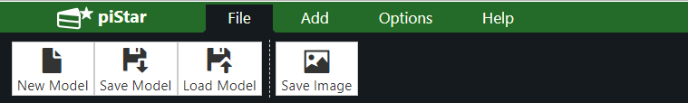
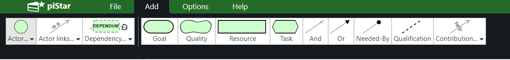
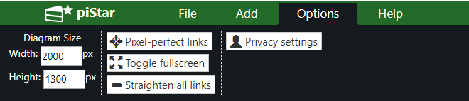
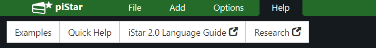
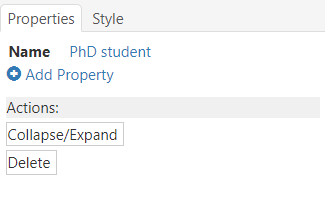
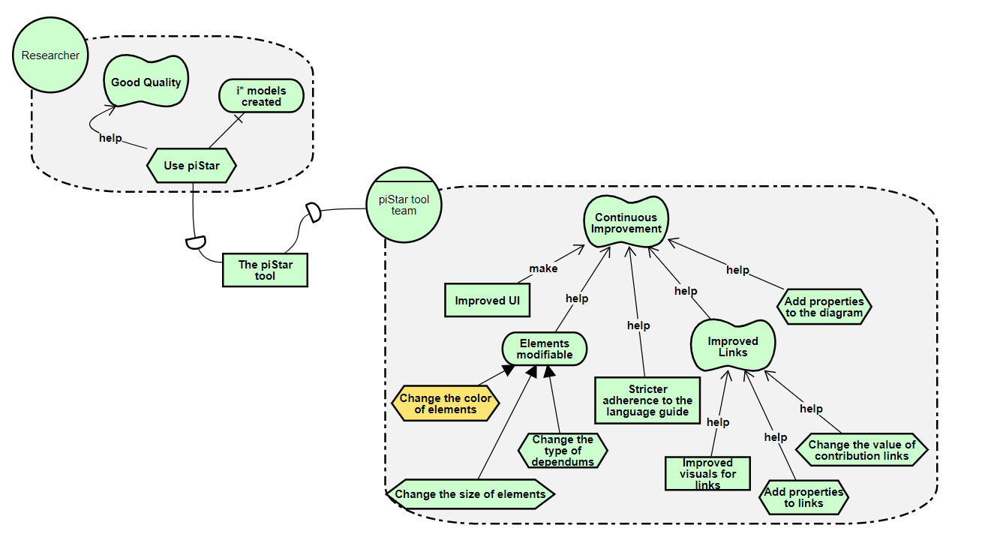
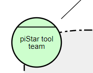
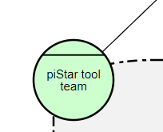

# User Manual to piStar Tool

This manual is divided into two parts, one to show the overview of the tool, which informs the user about the areas where it can interact 
with the piStar Tool. The second part shows in detail enumerated, showing the step by step actions that the user can perform in the tool.

## Part 1: Tool Overview

The piStar Tool is shown with a three-part splash screen, the Menu Bar, Properties Bar, and a Drawing Area with an example of a base model.

**The Menu Bar is divided into four sub-areas:**

1. **File**: Where you can save and load the template, save the template as an image, and create a new blank template.

2. **Add**: Where you can select the elements, links, dependencies, contributions, and refinements you want to add to the template

3. **Options**: Where you can perform privacy and visual settings, such as putting in full screen mode, making changes to the links you create, and changing the dimensions of the drawing area.

4. **Help**: Where you can find examples of model to base, links to research related to piStar Tool and about language i * a quick help on the tool itself.

**The Properties Bar is where the user sees and adds properties to their elements and template:**

**The Drawing Area is where the user make the model:**

## Part 2: Tool Actions

You can split a user's actions into five action sections. File Action, Preview Action, Change Action, Delete Action, and Add Action. The user can go to the section that represents the action he will take on his model.

1. **File Action:**

* To create a new model:
  1. Scroll to the Menu Bar and select File
  2. Select New Model
  3. Press OK
  4. **Result**: This action will delete your current template and leave the Drawing Area blank.
* To save your model:
  1. Scroll to the Menu Bar and select File
  2. Select Save Model
  3. **Result**: This action will download a file with the .txt extension called goalModel in the default directory of your browser
* To load your model:
  1. Scroll to the Menu Bar and select File
  2. Select Load Model
  3. Click Choose File, and then click Load Model.
* To To save your model as an image:
  1. Scroll to the Menu Bar and select File
  2. Select Save Image
  3. If desired, rename the file to be saved in the File Name field
  4. If desired, check the *checkbox* to apply the "*pixel-perfect-links*" effect, which adjusts the image by eliminating gaps between links and elements
  5. If desired, click on SVG to choose the format you want to save the image, being possible to choose between SVG and PNG.
  6. Click Save Image
  7. **Result**: This action will download your template in the format chosen in your browser's default directory

2. **View Action:**

* To use de tool in fullscreen
  1. Press button F11 in keyboard
    **Alternative**
      1. Scroll to the Menu Bar and select Options
      2. Click "Toggle Fullscreen"
  **Note:** Repeat to exit full screen mode
* To remove the gaps beteween the links and the elements:
  1. Scroll to the Menu Bar and select Options
  2. Click on "Pixel-perfect-links"
  3. **Result**: You will wait a few seconds for the tool to process the action and your model will be without any gaps between the links and elements, as in the example image:
  
         
  
* To zoom in on the project:
  1. Use your brwoser zoom

3. **Change Action:**
  
