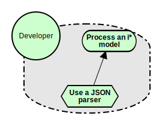
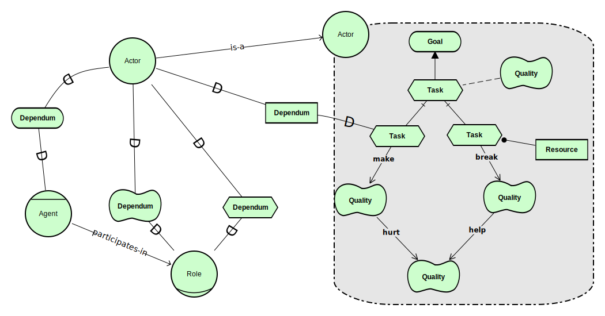

# JSON

The i* 2.0 models created with the piStar tool can be saved as a [JSON](https://en.wikipedia.org/wiki/JSON) (JavaScript Object Notation) document. This provides a way not only to store the model in your local drive, but also to send the model to a server for processing.


## Small Example



The model above represents the following JSON object:
```javascript
{
  "actors": [
    {
      "id": "b03d31e2-e1b7-46ae-8fc7-cca5d3e5d3f7",
      "text": "Developer",
      "type": "istar.Actor",
      "x": 224,
      "y": 88,
      "nodes": [
        {
          "id": "d55292b1-32e1-4c94-9345-15e125568c0d",
          "text": "Process an i* model",
          "type": "istar.Goal",
          "x": 321,
          "y": 99
        },
        {
          "id": "edbfa16a-424b-4465-9694-317e2e926440",
          "text": "Use a JSON parser",
          "type": "istar.Task",
          "x": 286,
          "y": 191
        }
      ]
    }
  ],
  "dependencies": [],
  "links": [
    {
      "id": "fc4a2efd-9787-4f02-9722-83409f7218d7",
      "type": "istar.OrRefinementLink",
      "source": "edbfa16a-424b-4465-9694-317e2e926440",
      "target": "d55292b1-32e1-4c94-9345-15e125568c0d"
    }
  ],
  "display": {},
  "tool": "pistar.1.1.0",
  "istar": "2.0",
  "saveDate": "Thu, 15 Mar 2018 10:28:46 GMT",
  "diagram": {
    "width": 1700,
    "height": 1300
  }
}
```

This model has one actor, named (```text```) "Developer".
This actor has two nodes: "Process an i* model", which is a Goal; and "Use a JSON parser", which is a Task.

This model has no dependencies.

This model has one link: from "Use a JSON parser" (id "edbfa16a-424b-4465-9694-317e2e926440")
to "Process an i* model" (id "d55292b1-32e1-4c94-9345-15e125568c0d").

This model has no display information. It was created with piStar v1.1.0, compliant to the i* 2.0 standard.
This JSON representation was created on March 15, 2018. The size of the diagram is 1700px x 1300px.

## Structure

## Complete example

The following diagram features every i* 2.0 element and link.



The model above represents the following JSON object:
```javascript
{
  "actors": [
    {
      "id": "2b3ba506-1f5b-4b5b-9114-01b1092cd067",
      "text": "Agent",
      "type": "istar.Agent",
      "x": 56,
      "y": 342,
      "nodes": []
    },
    {
      "id": "ccf83503-3c8f-4886-a30f-8a290499d8b2",
      "text": "Role",
      "type": "istar.Role",
      "x": 309,
      "y": 447,
      "nodes": []
    },
    {
      "id": "9cab7456-727b-4d7e-81dd-af8903718cb3",
      "text": "Actor",
      "type": "istar.Actor",
      "x": 202,
      "y": 76,
      "nodes": [
        {
          "id": "e1acd9b0-c9e9-468b-845c-c7b08db3020f",
          "text": "Goal",
          "type": "istar.Goal",
          "x": 284,
          "y": 105
        },
        {
          "id": "b64fbf2b-b55e-4510-b31f-9adef8de5b69",
          "text": "Task",
          "type": "istar.Task",
          "x": 305,
          "y": 199
        }
      ]
    },
    {
      "id": "6a76ceb5-f287-462d-bf57-a266cc19c243",
      "text": "Actor",
      "type": "istar.Actor",
      "x": 572,
      "y": 30,
      "nodes": [
        {
          "id": "4c3ba102-6514-47a4-b21c-8a8f8cdae0cc",
          "text": "Goal",
          "type": "istar.Goal",
          "x": 702,
          "y": 45
        },
        {
          "id": "e1270a5e-3c20-4be9-8097-66f6ed8502cd",
          "text": "Task",
          "type": "istar.Task",
          "x": 700,
          "y": 129
        },
        {
          "id": "60d0943c-169e-41ff-85ed-e19360456863",
          "text": "Task",
          "type": "istar.Task",
          "x": 634,
          "y": 209
        },
        {
          "id": "0a28f23e-2008-43b3-9e63-025bdfd5f30c",
          "text": "Task",
          "type": "istar.Task",
          "x": 768,
          "y": 207
        },
        {
          "id": "df52f053-20a2-4bdf-8e23-e8c53a8ce306",
          "text": "Quality",
          "type": "istar.Quality",
          "x": 572,
          "y": 322
        },
        {
          "id": "3ff6395e-86ec-4661-ba13-c0493331303b",
          "text": "Quality",
          "type": "istar.Quality",
          "x": 831,
          "y": 317
        },
        {
          "id": "85940cf3-6d49-4270-9b00-51696b5790f5",
          "text": "Quality",
          "type": "istar.Quality",
          "x": 699,
          "y": 455
        },
        {
          "id": "54c01821-aa4d-4bd0-9fdf-6ddaa25c299f",
          "text": "Resource",
          "type": "istar.Resource",
          "x": 922,
          "y": 233
        },
        {
          "id": "1ecba4f1-f873-466c-8074-092f612d5fed",
          "text": "Quality",
          "type": "istar.Quality",
          "x": 860,
          "y": 101
        }
      ]
    }
  ],
  "dependencies": [
    {
      "id": "fd083df6-87fc-4423-b25c-3291a1bf9aa3",
      "text": "Dependum",
      "type": "istar.Goal",
      "x": 12,
      "y": 178,
      "source": "9cab7456-727b-4d7e-81dd-af8903718cb3",
      "target": "2b3ba506-1f5b-4b5b-9114-01b1092cd067"
    },
    {
      "id": "9934417c-7c57-4272-837d-fb75b6eff101",
      "text": "Dependum",
      "type": "istar.Quality",
      "x": 181,
      "y": 332,
      "source": "e1acd9b0-c9e9-468b-845c-c7b08db3020f",
      "target": "ccf83503-3c8f-4886-a30f-8a290499d8b2"
    },
    {
      "id": "81fe40dc-2380-47c0-92ab-1e7281dc020c",
      "text": "Dependum",
      "type": "istar.Task",
      "x": 379,
      "y": 333,
      "source": "b64fbf2b-b55e-4510-b31f-9adef8de5b69",
      "target": "ccf83503-3c8f-4886-a30f-8a290499d8b2"
    },
    {
      "id": "7b339194-6020-4c2b-86e5-cd07ab9f725d",
      "text": "Dependum",
      "type": "istar.Resource",
      "x": 453,
      "y": 169,
      "source": "b64fbf2b-b55e-4510-b31f-9adef8de5b69",
      "target": "60d0943c-169e-41ff-85ed-e19360456863"
    }
  ],
  "links": [
    {
      "id": "9846d305-60d4-4d0b-a726-2ddb2e537ec7",
      "type": "istar.DependencyLink",
      "source": "9cab7456-727b-4d7e-81dd-af8903718cb3",
      "target": "fd083df6-87fc-4423-b25c-3291a1bf9aa3"
    },
    {
      "id": "514c3b35-5b1f-4d27-b80a-e9aa48c8c322",
      "type": "istar.DependencyLink",
      "source": "fd083df6-87fc-4423-b25c-3291a1bf9aa3",
      "target": "2b3ba506-1f5b-4b5b-9114-01b1092cd067"
    },
    {
      "id": "f4329249-db3b-457a-afef-5913999292de",
      "type": "istar.DependencyLink",
      "source": "e1acd9b0-c9e9-468b-845c-c7b08db3020f",
      "target": "9934417c-7c57-4272-837d-fb75b6eff101"
    },
    {
      "id": "3a9cafc3-b436-4175-88c3-e9010fe8c282",
      "type": "istar.DependencyLink",
      "source": "9934417c-7c57-4272-837d-fb75b6eff101",
      "target": "ccf83503-3c8f-4886-a30f-8a290499d8b2"
    },
    {
      "id": "748f9b53-91dd-4368-acdd-4ffe5a053bb0",
      "type": "istar.DependencyLink",
      "source": "b64fbf2b-b55e-4510-b31f-9adef8de5b69",
      "target": "81fe40dc-2380-47c0-92ab-1e7281dc020c"
    },
    {
      "id": "4d488654-0e1b-4de1-a573-f0dc35e7e65c",
      "type": "istar.DependencyLink",
      "source": "81fe40dc-2380-47c0-92ab-1e7281dc020c",
      "target": "ccf83503-3c8f-4886-a30f-8a290499d8b2"
    },
    {
      "id": "ef0ea7ee-56a5-414e-b106-e4c18161e6d4",
      "type": "istar.DependencyLink",
      "source": "b64fbf2b-b55e-4510-b31f-9adef8de5b69",
      "target": "7b339194-6020-4c2b-86e5-cd07ab9f725d"
    },
    {
      "id": "99e1e030-bcee-4552-a0ee-e8b3013a6631",
      "type": "istar.DependencyLink",
      "source": "7b339194-6020-4c2b-86e5-cd07ab9f725d",
      "target": "60d0943c-169e-41ff-85ed-e19360456863"
    },
    {
      "id": "e9d404e1-93c3-49c7-ac16-66275fbc9308",
      "type": "istar.OrRefinementLink",
      "source": "b64fbf2b-b55e-4510-b31f-9adef8de5b69",
      "target": "e1acd9b0-c9e9-468b-845c-c7b08db3020f"
    },
    {
      "id": "a767df2b-8703-4b66-ae59-5cb94cc05d1b",
      "type": "istar.IsALink",
      "source": "9cab7456-727b-4d7e-81dd-af8903718cb3",
      "target": "6a76ceb5-f287-462d-bf57-a266cc19c243"
    },
    {
      "id": "f2d9982f-2f81-43e1-a491-5881de607394",
      "type": "istar.OrRefinementLink",
      "source": "e1270a5e-3c20-4be9-8097-66f6ed8502cd",
      "target": "4c3ba102-6514-47a4-b21c-8a8f8cdae0cc"
    },
    {
      "id": "66940773-3e99-4765-b51f-744a95a26574",
      "type": "istar.AndRefinementLink",
      "source": "60d0943c-169e-41ff-85ed-e19360456863",
      "target": "e1270a5e-3c20-4be9-8097-66f6ed8502cd"
    },
    {
      "id": "8800fb72-4968-4e72-8ba4-7d9506fc8699",
      "type": "istar.AndRefinementLink",
      "source": "0a28f23e-2008-43b3-9e63-025bdfd5f30c",
      "target": "e1270a5e-3c20-4be9-8097-66f6ed8502cd"
    },
    {
      "id": "1954312c-f459-4f73-b578-1154ace5d580",
      "type": "istar.QualificationLink",
      "source": "1ecba4f1-f873-466c-8074-092f612d5fed",
      "target": "e1270a5e-3c20-4be9-8097-66f6ed8502cd"
    },
    {
      "id": "c4e77fff-11fe-4173-b9d8-244e573bca40",
      "type": "istar.NeededByLink",
      "source": "54c01821-aa4d-4bd0-9fdf-6ddaa25c299f",
      "target": "0a28f23e-2008-43b3-9e63-025bdfd5f30c"
    },
    {
      "id": "21248119-c37d-4135-acaa-7c94429881d3",
      "type": "istar.ContributionLink",
      "source": "60d0943c-169e-41ff-85ed-e19360456863",
      "target": "df52f053-20a2-4bdf-8e23-e8c53a8ce306",
      "label": "make"
    },
    {
      "id": "0937b2ab-d8e2-4910-91cc-4dbdd07275fe",
      "type": "istar.ContributionLink",
      "source": "0a28f23e-2008-43b3-9e63-025bdfd5f30c",
      "target": "3ff6395e-86ec-4661-ba13-c0493331303b",
      "label": "break"
    },
    {
      "id": "8f07ce60-bfd2-406e-9ef6-574930f455dd",
      "type": "istar.ContributionLink",
      "source": "3ff6395e-86ec-4661-ba13-c0493331303b",
      "target": "85940cf3-6d49-4270-9b00-51696b5790f5",
      "label": "help"
    },
    {
      "id": "36ad630e-16a6-4800-a7b5-43e553a653e4",
      "type": "istar.ParticipatesInLink",
      "source": "2b3ba506-1f5b-4b5b-9114-01b1092cd067",
      "target": "ccf83503-3c8f-4886-a30f-8a290499d8b2"
    },
    {
      "id": "360c5727-4e56-4bd8-96f1-25424cc68eae",
      "type": "istar.ContributionLink",
      "source": "df52f053-20a2-4bdf-8e23-e8c53a8ce306",
      "target": "85940cf3-6d49-4270-9b00-51696b5790f5",
      "label": "hurt"
    }
  ],
  "display": {
    "9846d305-60d4-4d0b-a726-2ddb2e537ec7": {
      "vertices": [
        {
          "x": 112,
          "y": 126
        }
      ]
    },
    "2b3ba506-1f5b-4b5b-9114-01b1092cd067": {
      "collapsed": true
    },
    "ccf83503-3c8f-4886-a30f-8a290499d8b2": {
      "collapsed": true
    },
    "9cab7456-727b-4d7e-81dd-af8903718cb3": {
      "collapsed": true
    }
  },
  "tool": "pistar.1.1.0",
  "istar": "2.0",
  "saveDate": "Thu, 15 Mar 2018 10:57:08 GMT",
  "diagram": {
    "width": 1500,
    "height": 1500
  }
}
```

Besides having actors and nodes of different types, this model also contain dependencies and the following display information:
- The vertex that creates the curvature that can be seem in the dependency link on the top left corner of the diagram.
- The three collapsed actors in the left half of the diagram

(collapsed actors and links' vertices).


## Changes

This section describes the changes that have been made to this JSON schema.

Hopefully, we will never make breaking
changes. If we do, we plan to provide backwards compatibility (starting from version 1.0.0), as follows: enable the user to load models into the
newest version of the tool, even if they were created with previous versions of the tool. This can be achieved in two
ways:
 - Directly, by having the loadModel function check the 'tool' attribute of the JSON object and behave differently
 according to its version
 - Indirectly, By providing an external utility to convert older models to the newest schema

### From 1.0.1 to 1.1.0
Starting from version 1.1.0, the piStar's JSON objects now has a ```display``` object in its root.
This ```display``` object is meant to store visual information of the diagrams, such as
the visual state of actors (collapsed or expanded) and
the vertices that define the shape of a link.

#### Compatibility:
 - Does this break loading 1.0.1 models into piStar 1.1.0?
   - No, if the display object is undefined it will be ignored.
 - Does this break loading 1.1.0 models into piStar 1.0.1?
   - No, the display object will simply be ignored.

### From 1.1.0 to 1.2.0
The ```display``` object inside piStar's JSON objects now captures the
background (fill) color of elements.

#### Compatibility:
- Does this break loading 1.1.0 models into piStar 1.2.0?
  - No, if the background color property is undefined it will be ignored.
- Does this break loading 1.2.0 models into piStar 1.1.0?
  - No, the background color property will simply be ignored.

## Development tips
  - There are plenty of libraries for parsing JSON objects and generating native objects in different programming
 languages (e.g., [Java](https://www.google.com.br/search?q=json+parser+java),
 [Haskell](https://www.google.com.br/search?q=json+parser+haskell),
 [PHP](https://www.google.com.br/search?q=json+php), and
 [Python](https://www.google.com.br/search?q=json+parser+python)).
  And vice-versa: there are also libraries for generating JSON objects from native
 objects in your language of choice.
 - If you want to send the model to a remote server for processing, the easiest way probably is to use
 [jQuery's AJAX methods](http://api.jquery.com/category/ajax/).   
   - Checkout [jQuery.post](http://api.jquery.com/jQuery.post/), in particular.
 - If you'd like to develop a plugin or extension where it is possible to add elements (such as a Goal)
 to the diagram itself, it is probably better (more compatible) to *not* change the JSON structure.
 Instead, add these elements to a placeholder Actor.
